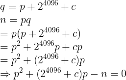

# Raisins, Strawberries and Apples (Crypto)
Files:
- [encrypt.cpp](encrypt.cpp)
- [encrypted.txt](encrypted.txt)
- [public.txt](public.txt)

Look at the title, already know it is a typical RSA crypto challenge!

`encrypt.cpp` is use to generate RSA key to encrypt the flag

`encrypted.txt` is the ciphertext

`public.txt` is the public key (n,e)

# Public Key Generation
First we look at how it generate the public key 

1. Generate a 4 bytes seed to generate random numbers
```cpp
unsigned int seed;
ifstream drand("/dev/random", ifstream::binary);
drand.read((char*)&seed, 4);
drand.close();

// Initialize a random number generator with our seed
gmp_randclass r(gmp_randinit_default);
r.seed(seed);
```
2. Generate a random 4096-bits number
```cpp
mpz_class p = r.get_z_bits(bits);
```
3. Find the next nearest prime number as `p`
```cpp
while (!mpz_probab_prime_p(p.get_mpz_t(), 30)) {
        p++;
}
```
4. `q` is equal to `p` XOR `1 << 4096`
```cpp
mpz_class q = p ^ (mpz_class(1) << bits);
```
5. Find the next nearest prime number as `q`
```cpp
while (!mpz_probab_prime_p(q.get_mpz_t(), 30)) {
        q++;
}
```
6. Make sure `e` and `lam` are coprime
```cpp
// Initialize remaining RSA parameters
mpz_class n = p*q,
          lam = lcm(p-1, q-1),
          e = 65537,
          d;

assert(gcd(e, lam) == 1);
```

Notice the step 4 is quite interesting!

`1 << 4096` is equal to `2^4096`, and `p` < `2^4096` because of 4096-bits

So we can also say that: 
```
Let c = distance to next prime
q = p + 2^4096 + c
```
Then we can form an equation using `n=pq`:



Therefore, bruteforce the `c` value we can calculate the roots of the equation!

I using a simple sage script to bruteforce and find the roots (No sage can use [this website](https://sagecell.sagemath.org/)):
```py
n = 460587847615321545312743112252681790529241995267520194089525006811445797148215192958348208384100142625634776957101208367836344890493123396256822067252454897370390919427503445239821745976720507227436990557330541596289387435466788792568238908859871724153573363204461793078176839890623142327864107813628367354874370992657805921933861244082061933530624507832723985891622538797271515813663783580973125731383848760835580786736541766700201586419207200285649518054917604740159198073136117252885773374341783995548367471015835659055652140098740368186458564858880400360536245384799742760597577398131816896767617208800067231267634260432369105083958817471773145223005496759178303810037977227302021311566238756530119560743589928314868307009151319439817700221656798613828676769720182396527775389082127492220218210430483482534338782234871817901827374509408391601928268025696596334315917182661132476182242062862853496614774368349052951570507517030347774920427858561905933873552683958779359325094033354038916131060953624074072701970886823355848591266722504297843135442416876771590941977753051363618953113917155470509518964566312402729432375615274667408329565775798030471833886758672712528273187134051868777945407133565900890344488190073927347338584043807286967483962717966300396984192006533050265348776012875883708142654253868881880293195035097400420731344709157126633944371617967838646865444062352505785976552588932487750409110356025456989907329167858117742506021543356248698832132093799060550535747511124214583855242178714068505268805853154285730197095600008875781778348239964757563706524480110749009504461618656084904290305714510768172794453041351549727381782324079507011253542957794139224454431183054919612635090277084110566333797818032500143500532664219223575407027410789904844927462552314613956629743945514940757624468030604824079333982444442232295379767067076479593469582786989277735008136591353003384103665517989311751745638856100259922754872554807838160211742877953752024379954317863868261030702391668774247610925379512304045779772579935259802865661249683745877462405996365079014672674809518943937107377437054507437070637886968491708430879767581698357853968421528718990831152377773930434191868718560551698466012662942808051147126074571400597367977230302822648531622843213589318319190634935548955305512082525228217247213333535482772800587883921544114433390032314156171967446698851513627000087137183607759805779294472721875365376553208433419389395131576043257675739482307818063
p = PolynomialRing(RationalField(), 'p').gen()
for c in range(10000):
	e = p^2 + (2^4096+c)*p - n
	if e.roots():
		print e.roots()
		print c
```
Result:
```
[(334120268684880788953539849969488955894730439412547803270401451206440425685834979060720362425414576019377255866825419456349304598926216938596653024574267398839213886809947984975819432351247497207666608324619170215046977927559067987657371566197068111163184400435736063821202547374047133476260242569492603512636511195497966971733361067480170954863093223788964650318722910345843729789217946389569544782052097849453773897745397091793035914763088561917243108457677634232975969641058874769424139536027722812860097925000664043690038532727819379694976955707493271979314572426250773160575571168445303161213964905100659768782083646586673436262926946929866951028593737142530082338632013633746830993589974584923698746996036056258485157380365203995511666423504340929710239245700543596096372734514489424906754564585978578996448356990106403647192708144050455342028159225901039570189637658969537733175116431504465314939758741316130433055512627563624457664671315497734952774998116504321840329002799797284848801619755139424253102905493009025027684954413835425684408100104547449128687186852816485946609236606327840295248827374604457504814226029550404821893203465035367168097910586959678279116921594799421238853577576493694605227553884590335038287431163, 1), (-1378509150098033295645292560686113338474694688459931583654634934490394333657392435909547174360412134360267362581264682294336878037112010545859889112425632676785170863353657983316181022485631215522094678336475116441423296766956780733329706250541654728659992309141539767892486596114165742590728220353090632519323450172379754757680266697670431895462672677221788119621749606788902754805190346257283760323745933409339065384063635006227532648850900434556739583557866675581984386702733968437757990087060694901129648694984280413101971547941616205532165047541150023200633065272618898710801569468857647946076560579592854385805890152499919047088658782309954559650696571412727780540945182651424837668785459664845335166366321431383269172287524339455494456936903952481504510352531677686680645618794280979756537518909513096061671626051501309634885710267013851029811038174341655577602583333889360783746758808659281636320389787219046569982220970420065188112571287399516418538471340354589093388902595793375648270821529764241971552772948668275206014024886954858849958907672769295700433560149701398766129554063330281221865738248752842583226155834073386679232181113138493254000911889373145468843594811290932370456498358231728041317797689298675441441626301, 1)]
4802
```
We found 2 roots! `p` must be the positive one! 

And `c` is 4802

Now we have `p` so we can find `q` and calculate the private key!

Wrote a [python script](solve.py) to calculate it:
```py
from Crypto.Util.number import *
c = 174701441663346719895775119544063649612104208295237109694644307412644413207489372492967372037318293490494103120926084098920487694000993637889901715301388033088583863095777614025067306621045397320970974283870812927439103540546518705681096359927999680763371761872210605838468202041648831883464844479681334010024863978904427652676042141602940122236032672938242621394803125486242820775750351025666152832082434721997508911384749982243070603501994504271628227129793677547670700603216524922936065701319276465403406844486953976682784831702395253350682262087270261914873581827183988720115635607948464376258565013175803347095426218951507170332234787344444085434838206344764513029308343416345845873695728228242579649692821784725820030841841960288190562229487388312873633909504100889879640537295776181498761426569918157393877880997611640629272511084185298890403726873005614285836000569416607261773131074907773727388919217187046534456992831240291923789138943756997948091080486883791830007573984502759555361368734062236635745517117304973438199709972420818811175568466936350296393078685818727514531377658216980070465019347784147129938530208310256048924822577443699727061192297196544312284414330990062733194262523279760206561717056574062971720614969367090156188327715929754106588816154067470230112185373017817893665238284487751811887760681552383586134874529935405377094085939006562735101243230652508210329481367304903984056866827296078635064616879714016435930394444583102505440845728150016593245137404981218751307090138605672998443892477264748173827059646951277270465800634157652651171351696384535486694519605726437020067915096610134247421749598676346027121157605873806008711564272401586980152701416176350765770128384419867856482167910845530471453798802165382266423239781876508067639541395535109461225627987244113304273469119940377082534220442991706704116096830061694829838583295599633389930725065865551556361509544018809721026650930846965307578053822224706328736416067198975717262636834783703110203720457474865498014143539041453266653532837499225933108252662039320238322522236595652841209226536259662094684976221829230806877987945309682741814571933245737918575645482085772885266492682226439323804370807760931351528460690643870548069165787213329440325578377100277541772658876330470691938783388635003597175174016933892274280000001231938355128261670888625090226194877490819445897658335642026698731279311917295399379918365687758862473166422191887956176607225150963355391297112108449122
n = 460587847615321545312743112252681790529241995267520194089525006811445797148215192958348208384100142625634776957101208367836344890493123396256822067252454897370390919427503445239821745976720507227436990557330541596289387435466788792568238908859871724153573363204461793078176839890623142327864107813628367354874370992657805921933861244082061933530624507832723985891622538797271515813663783580973125731383848760835580786736541766700201586419207200285649518054917604740159198073136117252885773374341783995548367471015835659055652140098740368186458564858880400360536245384799742760597577398131816896767617208800067231267634260432369105083958817471773145223005496759178303810037977227302021311566238756530119560743589928314868307009151319439817700221656798613828676769720182396527775389082127492220218210430483482534338782234871817901827374509408391601928268025696596334315917182661132476182242062862853496614774368349052951570507517030347774920427858561905933873552683958779359325094033354038916131060953624074072701970886823355848591266722504297843135442416876771590941977753051363618953113917155470509518964566312402729432375615274667408329565775798030471833886758672712528273187134051868777945407133565900890344488190073927347338584043807286967483962717966300396984192006533050265348776012875883708142654253868881880293195035097400420731344709157126633944371617967838646865444062352505785976552588932487750409110356025456989907329167858117742506021543356248698832132093799060550535747511124214583855242178714068505268805853154285730197095600008875781778348239964757563706524480110749009504461618656084904290305714510768172794453041351549727381782324079507011253542957794139224454431183054919612635090277084110566333797818032500143500532664219223575407027410789904844927462552314613956629743945514940757624468030604824079333982444442232295379767067076479593469582786989277735008136591353003384103665517989311751745638856100259922754872554807838160211742877953752024379954317863868261030702391668774247610925379512304045779772579935259802865661249683745877462405996365079014672674809518943937107377437054507437070637886968491708430879767581698357853968421528718990831152377773930434191868718560551698466012662942808051147126074571400597367977230302822648531622843213589318319190634935548955305512082525228217247213333535482772800587883921544114433390032314156171967446698851513627000087137183607759805779294472721875365376553208433419389395131576043257675739482307818063
e = 65537
p = 334120268684880788953539849969488955894730439412547803270401451206440425685834979060720362425414576019377255866825419456349304598926216938596653024574267398839213886809947984975819432351247497207666608324619170215046977927559067987657371566197068111163184400435736063821202547374047133476260242569492603512636511195497966971733361067480170954863093223788964650318722910345843729789217946389569544782052097849453773897745397091793035914763088561917243108457677634232975969641058874769424139536027722812860097925000664043690038532727819379694976955707493271979314572426250773160575571168445303161213964905100659768782083646586673436262926946929866951028593737142530082338632013633746830993589974584923698746996036056258485157380365203995511666423504340929710239245700543596096372734514489424906754564585978578996448356990106403647192708144050455342028159225901039570189637658969537733175116431504465314939758741316130433055512627563624457664671315497734952774998116504321840329002799797284848801619755139424253102905493009025027684954413835425684408100104547449128687186852816485946609236606327840295248827374604457504814226029550404821893203465035367168097910586959678279116921594799421238853577576493694605227553884590335038287431163
q = n // p
assert n == p*q

phi = (p-1)*(q-1)
d = inverse(e,phi)
m = pow(c,d,n)
print long_to_bytes(m)
# IceCTF{d0nt_r0ll_y0ur_0wn_crypt0}

```
Thats it! Fun RSA challenge!

## Flag
> IceCTF{d0nt_r0ll_y0ur_0wn_crypt0}